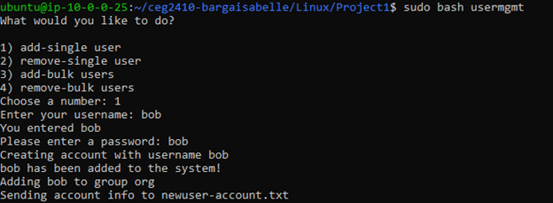
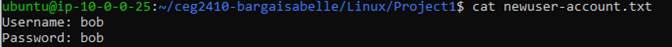
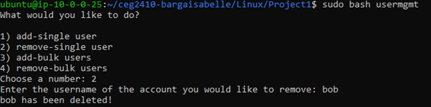
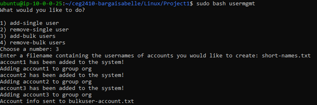
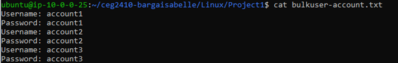
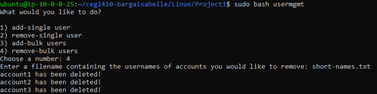

Script: usermgmt

This script can add a single user, remove a single user, add multiple users from a file, and remove multiple users from a file.

What it does:
When you run the script, a menu will appear with 4 options. Each number corresponds to one of the 4 functions in the script. 1 = add single user, 2 = remove single user, 3 = add bulk users, and 4 = remove bulk users.

How to run:
In the command line, type "sudo bash usermgmt"
- a menu will appear, with 4 options
- select the number that corresponds to the desired function you would like to run

If you select the first option
- you will be prompted to enter a user name and then a password
- the script will check if this user has already been created
- if it has, it will not create another account but will still add this account to the group, org. 
- if the user has not been created, then it will create this user an account and will also be added to the group, org 
- all accounts will be given group permissions to the user's home directory
- then, the username and password will be redirected to newuser-account.txt

add-single output:

newuser-account.txt output:

If you select the second option
- you will be prompted to enter a username
- the user will be removed from the group, org
- the user's home directory and account will be deleted

remove-single output:

If you select the third option
- you will be prompted to enter a filename (expected file contents below)
	- this file must have one user per line
	- must not contain extra characters, only the user name
- the script will check line by line if the user's already have an account
- if they do not, an account will be created
- all accounts will still be added to the group, org
- and given group permissions to access the user's home directory
- lastly, each username and password will be outputted to bulkuser-account.txt

add-bulk output:

bulkuser-account.txt output:

If you select the fourth option
- you will be prompted to enter a filename (expected file contents below)
	- this file must have one user per line
        - must not contain extra characters, only the user name
- the script will remove user's line by line
- it removes the user from the group, org
- then deletes the user account and home directory

remove-bulk output:

