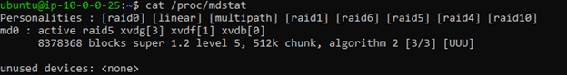

## Part 1

Raid type chosen: Raid 5

Pros:
  - can handle one disk failure
  - parity information is distributed across disks
  - increased write speed
  - increased read speed because data is striped across disks
  - better redundancy

Cons:
  - if more than one disk fails, then data is lost
  - less secure than a Raid 6

Command to build: sudo mdadm --create --verbose /dev/md0 --level=5 --raid-devices=3 /dev/xvdb /dev/xvdf /dev/xvdg

## Part 2

command to check RAID status: cat /proc/mdstat

  - Personalities are the RAID level that your(my) kernel can support.
  - The second line shows the name of the array, md0, the type of array, RAID 5, the state, active, and the 
    component devices used to build the array. The numbers in the brackets describe the role of the device in 
    the array.
  - The next line gives the number of blocks provided by the devices, 8378368, the metadata version, 1.2, and 
    the chunk size of the array, 512k. The first number in the following brack shows the size of the array and
    the second number shows the currently available number of devices. Lastly, the U represents healthy devices.
  - Unused devices = none because there are no devices not in use by an array

## Part 3

