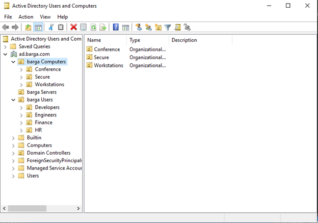
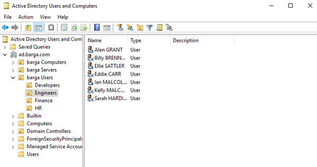
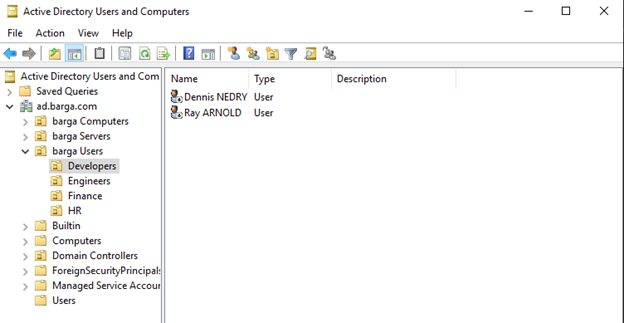
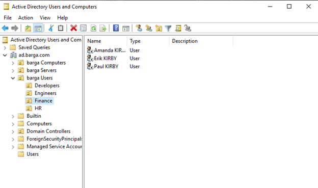
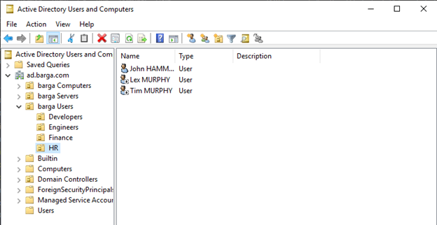
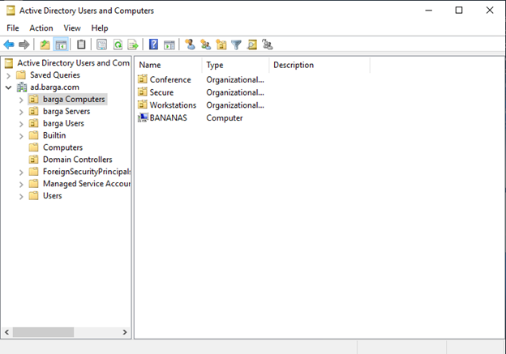
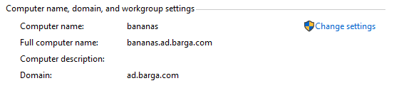

## Setup AD DC

- Configuring a Windows Server to be a Domain Controller
  - Install Active Directory Domain Services
  - Select 'Add Roles and Features' in the configuration menu, which will open the Wizard
  - Select 'Next' until you reach Server Roles
  - Ensure 'Active Directory Domain Services' is selected
  - Then you may proceed to Install (will most likely restart upon installation)
 
  - In the Active Directory Services Configuration Wizard, where you can promote the server into a Domain Controller
  - Select 'Add a new forest' and enter a root domain name
  - The other options are unneccessary and you may click 'Install'
  - Congrats! You made a AD DC.

- Domain Name: ad.barga.com
- Domain Controller Name: DC1
- Domain DNS IP: 10.0.0.208

## Create OUs

## Joining Users

## Joining Computers

First you need your server instances:
  - Create a Windows Server, WinServ1, on AWS. Do not auto assign a public IP and do not allow it to be reassigned.
  - Take note of the VPC and the private IP created.
  - Access the instance page and select WinServ1. Select 'Actions', from the drop-down select 'Security' and 'Get Windows Password'
  - On this page you will need to decrypt your Private key. This will output the user name 'Administrator' and a password used to access the domain server.
  - Similarly, create a second Windows Server, WinServ2, and decrypt the Windows Password.
  - Connect to each instance in WSL2.

Now that they both are set up, connect:
  - On WinServ2, you will need to access your Preferred DNS Server and update that to WinServ1's private IP.
  - This can be accessed be entering the servers File Explorer
  - Right click on 'This PC' and select 'Properties'
  - Select 'Change Settings' towards the bottom of the that page
  - Select 'Change' on the window that pops up
  - Enter the new computer name and the Domain you are trying to connect to
  - Select Okay and you should be prompted for you Administrator username and password saved earlier
  - your computer will likely ask you to restart

# OUs & GPOs

## Applying Group Policies

Lock out Workstations after 15 minutes of inactivity. >> Workstations (barga Computers)

- Open Group Policy Management on your server
- Select Workstations > 'Create GPO...'
- Give it a name, save, and select it for editting.
- Access 'Computer Config > Policies > Windows Settings > Security Settings > Local Policies > Security Options
 and find Interactive logon: Machine inactivity limit'
 - Change seconds to 900 and hit 'Apply'
 Source: https://serverfault.com/questions/79418/enforcing-lock-screen-after-idle-time-via-gpo#:~:text=Create%20a%20new%20GPO%20then,after%20it%20hits%20that%20timer.

Prevent execution of programs on computers in Secure OU >> Secure (barga Computers)

- Open Group Policy Management on your server
- Select Secure > 'Create GPO...'
- Give it a name, save, and select it for editting.
- User Configuration > Administrative Templates > System > Don't run specified Windows application > add programs
Source: https://www.technipages.com/prevent-users-from-running-certain-programs

Disable Guest account login to computers in Secure OU >> Secure (barga Computers)

- Open Group Policy Management on your server
- Select Group Policy Objects
- Give it a name, save, and select it for editting.
- Computer Configuration > Policies > Windows Settings > Security Settings > Local Policies > Security Options
and find Accounts: Guest account status Properties and disable the policy setting
Soruce: https://techexpert.tips/windows/gpo-disable-guest-account/

Allow server_access to sign on to Servers >> barga Servers

- Open Group Policy Management on your server
- Select barga Servers 'Create GPO...'
- Give it a name, save, and select it for editting.
- Computer Configuration > Policies > Windows Settings > Security Settings > Local Policies > User Rights Assignment
Source: https://docs.microsoft.com/en-us/windows/security/threat-protection/security-policy-settings/allow-log-on-locally

Set Desktop background for Conference computers to company logo. >> Conference (barga Computers)

- Open Group Policy Management on your server
- Select Conference > 'Create GPO...'
- Give it a name, save, and select it for editting.
- User Configuration > Administrative Templates > Desktop > Desktop
Source: https://www.prajwaldesai.com/deploy-desktop-background-wallpaper-using-group-policy/

Allow users in remote_workstation group to RDP to Workstations >> Workstations (barga Computers)
- Open Group Policy Management on your server
- Select Workstations > 'Create GPO...'
- Give it a name, save, and select it for editting.
- Computer Configuration > Administrative Templates > Windows Components > Remote Desktop Services > Remote Desktop Session Host > Connections
Source: https://softwarekeep.com/help-center/how-to-enable-remote-desktop-on-windows#:~:text=How%20to%20Enable%2FDisable%20Remote%20Desktop%20Using%20Group%20Policy&text=After%20Local%20Group%20Policy%20Editor,Desktop%20Session%20Host%20%3E%3E%20Connections.&text=Select%20Enabled%20and%20click%20Apply%20if%20you%20want%20to%20enable%20Remote%20Desktop.

## Managing OUs

Document how to delagate control of an OU to a group

which OUs they now delegate

and what permissions they were given (and why you think the scope is appropriate)
